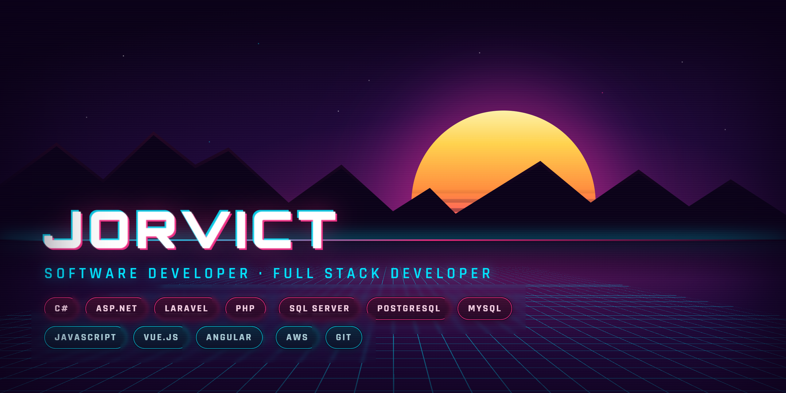

<!-- Presentación  -->
# 👋 Hola, soy Jorvict

### Software Developer | Full Stack Developer

Soy desarrollador de software enfocado en el desarrollo de aplicaciones web,
automatización de procesos e integración de sistemas empresariales.

💻 Actualmente trabajo principalmente con C#, Laravel, Vue.js y SQL Server.

🚀 También tengo experiencia trabajando con SAP, Service Layer y AWS.

📚 Actualmente estoy fortaleciendo mis conocimientos en desarrollo web moderno
y arquitectura de software.

<!-- Contacto -->

<!-- Acerca de mi -->
## 🚀 Sobre mí

- 💻 Desarrollador de software enfocado en el desarrollo de aplicaciones web.
- 🔧 Experiencia trabajando con C#, ASP.NET, Laravel, Vue.js y SQL Server.
- 🏢 Experiencia en el desarrollo de aplicaciones empresariales y automatización de procesos.
- 🔗 Experiencia en integración de aplicaciones con SAP mediante Service Layer.
- ☁️ Experiencia en despliegue de aplicaciones utilizando AWS EC2.
- 📊 Experiencia trabajando con SQL Server, PostgreSQL y MySQL.
- ⚡ Interesado en arquitectura de software, automatización y tecnologías web modernas.

<!-- Tecnologías -->
## 🛠️ Tech Stack

### Backend

### Frontend

### Database

### Cloud & Tools

<!-- GitHub Stats -->
## 📊 GitHub Stats

<table>
  <tr>
    <td>
      
    </td>
    <td>
      
    </td>
  </tr>
</table>

  

<!-- GitLab Stats -->
## 📊 GitLab Stats

<!--

-->
<!--

-->

<!--
**Jorvict/Jorvict** is a ✨ _special_ ✨ repository because its `README.md` (this file) appears on your GitHub profile.

Here are some ideas to get you started:

- 🔭 I’m currently working on ...
- 🌱 I’m currently learning ...
- 👯 I’m looking to collaborate on ...
- 🤔 I’m looking for help with ...
- 💬 Ask me about ...
- 📫 How to reach me: ...
- 😄 Pronouns: ...
- ⚡ Fun fact: ...
-->
